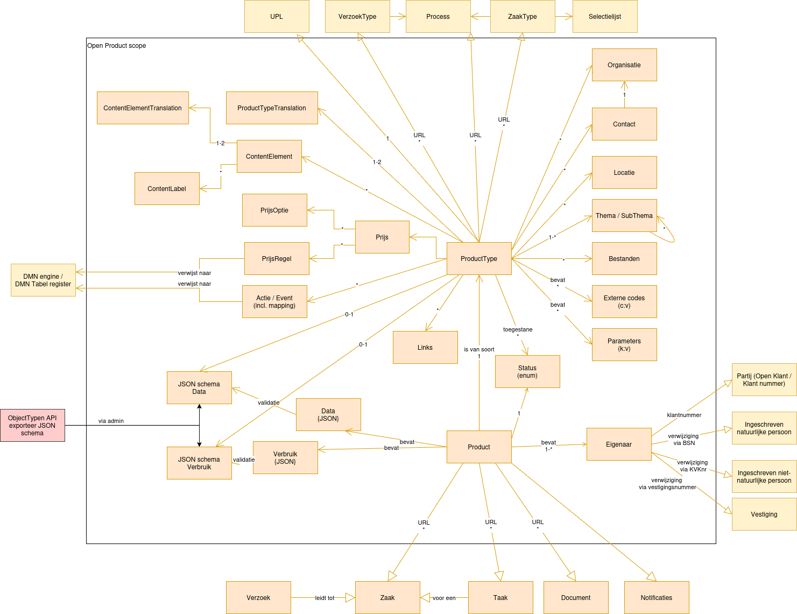

============
Open Product
============

:Version: 0.0.5
:Source: https://github.com/maykinmedia/open-product
:Keywords: ``producten``

Plek voor gemeenten om producttypen en producten te beheren om ze te gebruiken in andere applicaties.
(`English version`_)

Ontwikkeld door `Maykin B.V.`_.

Introductie
===========

Open Product is een applicatie waarin producttypen en producten op een enkele plek kunnen worden beheerd.
Andere applicaties zoals Open Inwoner en Open Formulieren kunnen met Open Product via een REST API integreren om bijvoorbeeld producttypen informatie te tonen, producten aan te maken of om de actuele prijs van een producttype op te halen.

Dit project zit op dit moment in de ontwikkelingsfase.

In Open Product worden producttypen en producten opgeslagen. Een producttype is bijvoorbeeld een parkeervergunning en bevat alle relevante informatie zoals wat de regels zijn, hoe verschillende zones werken enz.
Een product is in dit voorbeeld een parkeervergunning van een persoon en bevat in dit geval het kenteken en de persoonsgegevens.

Informatiemodel
===============

API specificatie
================

Producten
---------

==============  ==============  =============================
Versie          Release datum   API specificatie
==============  ==============  =============================
latest          n/a             `ReDoc <https://redocly.github.io/redoc/?url=https://raw.githubusercontent.com/maykinmedia/open-product/master/src/producten-openapi.yaml>`_,
                                `Swagger <https://petstore.swagger.io/?url=https://raw.githubusercontent.com/maykinmedia/open-product/master/src/producten-openapi.yaml>`_
==============  ==============  =============================

Producttypen
------------

==============  ==============  =============================
Versie          Release datum   API specificatie
==============  ==============  =============================
latest          n/a             `ReDoc <https://redocly.github.io/redoc/?url=https://raw.githubusercontent.com/maykinmedia/open-product/master/src/producttypen-openapi.yaml>`_,
                                `Swagger <https://petstore.swagger.io/?url=https://raw.githubusercontent.com/maykinmedia/open-product/master/src/producten-openapi.yaml>`_
==============  ==============  =============================

Er zijn twee manieren om te authenticeren met de API.

* Een api token kan worden aangemaakt in Open Product admin -> Users -> Tokens.
* OpenId Connect kan worden ingesteld in the Open Product admin -> Configuratie -> OpenID connect configuratie.

See: `Alle versies en veranderingen <https://github.com/maykinmedia/open-product/blob/master/CHANGELOG.rst>`_

Ontwikkelaars
=============

|build-status| |coverage| |black| |python-versions|

Deze repository bevat de broncode voor Open Product. Om snel aan de slag
te gaan, raden we aan om de Docker image te gebruiken. Uiteraard kan je ook
het project zelf bouwen van de broncode. Zie hiervoor
`INSTALL.rst <INSTALL.rst>`_.

Open Product bestaat uit drie apps:

* producttypen
* products
* locations (& organisations)

Quickstart
----------

1. Download en start openproduct:

   .. code:: bash

      $ wget https://raw.githubusercontent.com/maykinmedia/open-product/master/docker-compose.yml
      $ docker-compose up -d --no-build
      $ docker-compose exec web src/manage.py createsuperuser

2. In de browser, navigeer naar ``http://localhost:8000/`` om de beheerinterface
   en de API te benaderen.

Links
=====

* `Documentatie <https://open-product.readthedocs.io/en/stable/>`_
* `Docker image <https://hub.docker.com/r/maykinmedia/open-product>`_
* `Issues <https://github.com/maykinmedia/open-product/issues>`_
* `Code <https://github.com/maykinmedia/open-product>`_

Licentie
========

Copyright © Maykin 2024

Licensed under the EUPL_

.. _`English version`: README.EN.rst

.. _`Maykin B.V.`: https://www.maykinmedia.nl

.. _`EUPL`: LICENSE.md

.. |build-status| image:: https://github.com/maykinmedia/open-product/actions/workflows/ci.yml/badge.svg?branch=master
    :alt: Build status
    :target: https://github.com/maykinmedia/open-product/actions?query=workflow%3Aci

.. |coverage| image:: https://codecov.io/github/maykinmedia/open-product/branch/master/graphs/badge.svg?branch=master
    :alt: Coverage
    :target: https://codecov.io/gh/maykinmedia/open-product

.. |black| image:: https://img.shields.io/badge/code%20style-black-000000.svg
    :alt: Code style
    :target: https://github.com/psf/black

.. |python-versions| image:: https://img.shields.io/badge/python-3.11%2B-blue.svg
    :alt: Supported Python version

